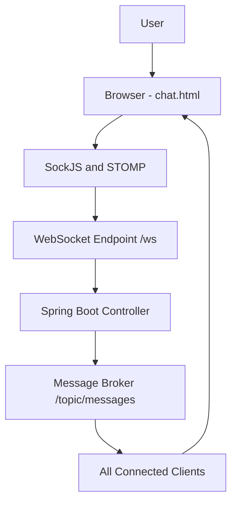

# 💬 ChatSphere – Real-Time Chat Application

ChatSphere is a real-time web-based chat application built using **Spring Boot WebSocket**, **STOMP**, and **SockJS**.  
It enables multiple users to communicate instantly through a modern and responsive chat interface.

This project was developed to gain hands-on experience with **real-time communication**, **WebSocket architecture**, and **frontend–backend integration** using Spring Boot.

---

## Features

- 🔄 Real-time messaging using WebSockets
- 📡 STOMP protocol for message routing
- 🌐 SockJS fallback support for browser compatibility
- 👤 Multi-user chat support
- 🕒 Message timestamps
- 🎨 Modern glassmorphism UI
- 📱 Responsive design
- ⚡ Auto-scroll and smooth message animations

---

## Tech Stack

### Backend
- Java
- Spring Boot
- Spring WebSocket
- STOMP Protocol
- SockJS

### Frontend
- HTML5
- CSS3
- Bootstrap 5
- JavaScript

---

## 🔄 Flow Diagram


---

## ⚙️ How the Application Works

1. The client connects to the WebSocket endpoint `/ws`
2. Messages are sent from the client to `/app/sendMessage`
3. Spring Boot handles messages using `@MessageMapping`
4. Messages are broadcast to `/topic/messages`
5. All connected clients receive messages instantly

---

## ▶️ How to Run the Project

### Prerequisites
- Java 17 or above
- Maven
- IntelliJ IDEA (recommended)

### Steps

```bash
git clone https://github.com/<your-username>/ChatSphere-SpringBoot-WebSocket.git
cd ChatSphere-SpringBoot-WebSocket
mvn spring-boot:run
```

## Open your browser and visit:
`http://localhost:8080/chat`


## 📁 Project Structure
```ChatSphere-SpringBoot-WebSocket/
src/
 └── main/
     ├── java/com/example/chatApp/
     │   ├── config/
     │   │   └── WebSocketConfig.java
     │   ├── controller/
     │   │   └── ChatController.java
     │   └── model/
     │       └── ChatMessage.java
     └── resources/
         ├── templates/
         │   └── chat.html
         └── application.properties
```

## Learnings from This Project

- Understanding the difference between HTTP and WebSocket communication
- Implementing real-time bidirectional communication
- Using STOMP protocol for structured message routing
- Configuring Spring Boot WebSocket Message Broker
- Handling JSON serialization and deserialization
- Debugging WebSocket payload and mapping issues
- Designing a modern and responsive UI
- Using Git and GitHub effectively with IntelliJ IDEA

## Key Spring Concepts Used

- @EnableWebSocketMessageBroker
- @MessageMapping
- @SendTo
- WebSocket endpoints
- Application destination prefixes
- Simple message broker


## ⭐ If you find this project useful, feel free to star the repository!
